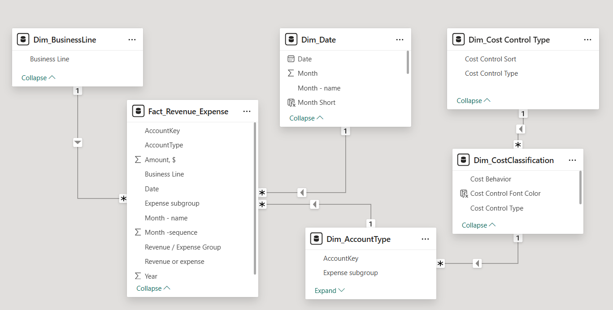
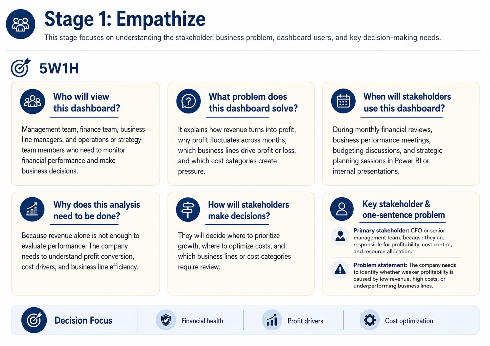

# Financial Performance Dashboard 2023

## Table of Contents

1. [Project Context and Business Problem](#1-project-context-and-business-problem)
2. [Report Audience](#2-report-audience)
3. [Dataset and Data Model](#3-dataset-and-data-model)
4. [Design Thinking Process](#4-design-thinking-process)
5. [Dashboard Pages](#5-dashboard-pages)
6. [Conclusion and Strategic Recommendations](#6-conclusion-and-strategic-recommendations)

## 1. Project Context and Business Problem

This project analyzes the 2023 financial performance of a sports and wellness-related retail company with three main business lines: **Sports equipment, Sportswear, and Nutrition and Food Supplements**.

Although the company generated revenue throughout the year, total revenue alone does not fully reflect financial health. Profitability can be weakened by high expenses, inefficient business lines, or cost categories that put pressure on margins.

Using Power BI, this project goes beyond basic financial reporting to analyze how revenue is converted into profit across time, business lines, and major cost categories. The goal is to identify where profit is being created, where it is being reduced, and which areas should be prioritized for growth, cost optimization, or further review.

The dashboard is designed to answer the following business questions:

- Is the company financially healthy overall?
- How did revenue, expenses, and profit change over time?
- Which business lines should be prioritized, maintained, optimized, or reviewed?
- Which cost categories create the most pressure on profitability?
- Where should cost optimization efforts be focused?

## 2. Report Audience

This dashboard is designed for management teams, finance teams, business line managers, and operations or strategy teams.

- Management teams can use the dashboard to evaluate overall financial health and make resource allocation decisions.
- Finance teams can use it to monitor revenue, expenses, COGS, OPEX, EBIT, profit margin, and expense ratio.
- Business line managers can use it to compare revenue, cost, profitability, and margin across business lines.
- Operations and strategy teams can use it to identify cost drivers and cost optimization opportunities.

## 3. Dataset and Data Model

### 3.1 Dataset Description

The dataset used in this project is `Financial_analysis_dataset.xlsx`.

The original dataset contains monthly revenue and expense records for the company in 2023. Each row represents a financial record by month, business line, income or expense type, income/expense group, and expense subgroup.

The dataset is used to calculate financial metrics such as total revenue, total expense, net profit, profit margin, expense ratio, COGS, OPEX, and EBIT.

### 3.2 Data Model Structure

Although the original dataset contains one main financial table, additional dimension tables were created in Power BI to support cleaner analysis, filtering, sorting, and business logic.

The data model follows a simple star schema structure, with `Fact_Revenue_Expense` as the central fact table and several dimension tables connected to it.

The main tables include:

| Table | Description |
|---|---|
| Fact_Revenue_Expense | Main fact table containing revenue and expense records, amount, date, business line, expense subgroup, and income/expense group |
| Dim_Date | Date dimension used for month, month name, month sorting, and time-based analysis |
| Dim_BusinessLine | Business line dimension used to analyze performance across Sports equipment, Sportswear, and Nutrition and Food Supplements |
| Dim_AccountType | Account type dimension used to classify expense subgroups and support cost breakdown analysis |
| Dim_CostClassification | Supporting table used to classify cost behavior and cost control type |
| Dim_Cost Control Type | Supporting dimension used to sort and group cost control actions |

### 2.3 Relationships

The model uses one-to-many relationships between dimension tables and the main fact table where applicable.

Key relationships include:

| From Table | To Table | Relationship Purpose |
|---|---|---|
| Dim_Date | Fact_Revenue_Expense | Enables monthly and time-based financial trend analysis |
| Dim_BusinessLine | Fact_Revenue_Expense | Enables revenue, expense, profit, and margin analysis by business line |
| Dim_AccountType | Fact_Revenue_Expense | Supports expense subgroup and account type analysis |
| Dim_AccountType | Dim_CostClassification | Connects expense subgroups with cost behavior and cost control logic |
| Dim_Cost Control Type | Dim_CostClassification | Supports cost control type sorting and optimization priority analysis |

This model structure helps separate raw financial records from analytical dimensions, making the dashboard easier to filter, maintain, and expand.

## 4. Design Thinking Process

Before building the Power BI dashboard, the Design Thinking framework was used to clarify the business context, stakeholder needs, key metrics, and dashboard structure.

The process includes three stages: Empathize, Define Point of View, and Ideate.

### Stage 1: Empathize

This stage focuses on understanding the stakeholder, business problem, dashboard users, and key decision-making needs.

#### 5W1H

#### Empathy Map

---

### Stage 2: Define Point of View

This stage defines the main business value, Northstar Metrics, and important analytical viewpoints. The selected Northstar Metrics are Net Profit and Profit Margin because the dashboard focuses on both revenue growth and cost control.

## 5. Dashboard Pages

### Page 1: Overview

This page provides a high-level summary of the company’s financial performance in 2023. It gives a quick view of revenue, expenses, net profit, profit margin, and expense ratio, while also showing how revenue is converted into net profit after major cost layers.

## Key Insights

- The company was **profitable in 2023**, with **`17.56M` in revenue**, **`4.31M` in net profit**, and a **profit margin of `24.57%`**.
- However, total expenses reached **`13.25M`**, leading to a high **expense ratio of `75.43%`**.
- The **profit bridge** shows that **COGS** and **OPEX** were the main cost layers reducing profitability, rather than **interest** and **tax**.
- **Sports equipment** generated the highest revenue, but also carried high expenses.
- **Sportswear** was the most efficient business line in converting revenue into profit, with the strongest margin.
- **Nutrition and Food Supplements** was the key concern because expenses exceeded revenue, resulting in a **negative margin**.
- The main cost pressure points were **Labor**, **Payroll**, **Equipment**, and **Marketing**.

### Business Implication

The company is financially profitable, but profitability is under pressure from a high expense ratio. Cost optimization should focus on **COGS**, **OPEX**, and the major cost drivers, while management should further review low-margin or loss-making business lines before allocating more resources.

---

### Page 2: Financial Performance Analysis

This page analyzes how revenue, expenses, net profit, COGS, and OPEX changed over time. It helps evaluate whether revenue growth was translated into profit improvement.

### Key Insights

The company maintained **positive revenue throughout 2023**, but **profit performance was not stable**. Revenue was strongest in **January** and **December**, while net profit dropped noticeably in **April**, **September**, and **November**.

This shows that the company did not have a revenue problem across the whole year. Instead, the main issue was a **profit conversion problem** in several months.

The cost breakdown shows that **COGS** and **OPEX** played an important role in shaping monthly net profit. In months where net profit weakened, **COGS and OPEX remained relatively high compared with revenue**. This suggests that weaker profit was not caused only by lower revenue, but also by **cost pressure**.

The growth trend supports this finding. **Revenue growth** and **net profit growth** did not always move in the same direction. Some months showed revenue recovery, but profit did not improve at the same pace. This means **revenue growth alone was not enough** to improve financial performance if costs were not controlled.

When narrowing down by business line, **Sports equipment** contributed the largest share of revenue across the year, while **Sportswear** remained a meaningful contributor. **Nutrition and Food Supplements** contributed the smallest revenue share, suggesting that this business line had limited ability to support overall profitability.

The P&L breakdown confirms the main issue: the company generated **`17.56M` in revenue** and **`10.85M` in gross profit**, but **COGS of `6.71M`** and **OPEX of `5.60M`** significantly reduced operating profit.

### Business Implication

The root cause of weaker profit months appears to be **cost pressure**, especially from **COGS** and **OPEX**, rather than a complete lack of revenue. Management should therefore focus not only on growing revenue, but also on improving **profit conversion**, controlling major cost layers, and reviewing business lines with weaker contribution to profitability.

---

### Page 3: Business Line Performance

This page compares Sports equipment, Sportswear, and Nutrition and Food Supplements in terms of revenue, expenses, net profit, and profit margin. It identifies which business lines drive revenue scale, which ones generate stronger profitability, and which ones require review.

### Key Insights

The **profit bridge** shows that the company generated **`17.56M` in revenue** and retained **`4.31M` as net profit** after deducting **COGS**, **OPEX**, **interest**, and **tax**. This confirms that the company was **profitable overall**, but the next question is which business lines actually contributed to or weakened this profit.

The business line comparison shows that **Sports equipment** generated the highest revenue at **`8.9M`**, but also carried high expenses of **`6.6M`**, leaving **`2.3M` in net profit**.

**Sportswear** generated lower revenue at **`6.8M`**, but with lower expenses of **`4.1M`**, it delivered the highest net profit at **`2.7M`**. This indicates that Sportswear was the most effective business line in converting revenue into profit.

In contrast, **Nutrition and Food Supplements** generated only **`1.8M` in revenue** but incurred **`2.6M` in expenses**, resulting in a loss of **`-0.7M`**.

The margin chart confirms this difference in profitability. **Sportswear** had the strongest profit margin at **`40.2%`**, while **Sports equipment** had a lower but still positive margin of **`25.71%`**. **Nutrition and Food Supplements** had a negative margin of **`-38.67%`**, showing that this business line did not convert revenue into profit.

The monthly revenue trend also shows that **Nutrition and Food Supplements** remained the smallest revenue contributor throughout the year. Therefore, its loss appears to come from both **weak revenue scale** and **expenses that were too high compared with revenue**.

### Business Implication

Based on the decision matrix:

- **Sportswear** should be **prioritized** because it has the strongest profitability.
- **Sports equipment** should be **maintained and optimized** because it drives the largest revenue but also carries high expenses.
- **Nutrition and Food Supplements** should be **reviewed before further investment** because it has weak revenue scale and a negative profit margin.

---

### Page 4: Cost and Category Analysis

This page analyzes the company’s expense structure and identifies major cost drivers. It also classifies cost categories based on whether they can be optimized, reviewed carefully, or are difficult to reduce.

### Key Insights
The cost structure shows that **COGS** and **OPEX** were the two main expense groups in 2023. **COGS accounted for `6.71M`**, representing **`50.67%` of total expenses**, while **OPEX accounted for `5.60M`**, representing **`42.31%`**.

In contrast, **interest and tax accounted for only `0.93M`**, meaning the main cost pressure came from **core business operations** rather than financing or tax-related items.

Across the year, **COGS stayed higher than OPEX in most months**, confirming that production-related costs were the largest cost layer affecting profitability. The top cost drivers also show that **Labor** was the biggest cost item at **`4.5M`**, followed by **Payroll at `1.8M`** and **Equipment at `1.3M`**. This suggests that **people-related costs and operating capacity** were the main sources of cost pressure.

The cost ratio trend shows that both **COGS ratio** and **OPEX ratio** increased from **Q1 to Q3** before decreasing in **Q4**. This means cost pressure peaked around **Q3** and improved toward the end of the year. However, because the overall **expense ratio remained high at `75.43%`**, cost control is still an important priority.

The optimization detail shows that variable costs such as **Marketing**, **Materials**, **Packaging**, and **Shipping** can be optimized first because they are more flexible. In contrast, **Labor**, **Payroll**, and **Equipment** should be reviewed carefully because they are semi-fixed or fixed costs and may directly support business operations.

### Business Implication

The company should not cut costs blindly. A better approach is to **optimize flexible costs first**, then review major **people-related and capacity-related costs** based on productivity, utilization, and contribution to revenue.

Cost optimization should therefore focus on:

- **Marketing, Materials, Packaging, and Shipping** as the first optimization layer.
- **Labor, Payroll, and Equipment** as the second review layer.
- **COGS and OPEX** as the main cost categories to monitor over time.

## 6. Conclusion and Strategic Recommendations

This section connects the dashboard findings back to the key business questions defined at the beginning of the project.

### 6.1 Answering the Business Questions

| Business Question | Dashboard Answer |
|---|---|
| **Is the company financially healthy overall?** | The company was profitable in 2023, with **`17.56M` in revenue**, **`4.31M` in net profit**, and a **profit margin of `24.57%`**. However, the **expense ratio was high at `75.43%`**, showing that profitability was under cost pressure. |
| **How did revenue, expenses, and profit change over time?** | Revenue remained positive throughout the year, but profit was unstable. This shows that the main issue was not revenue generation, but **profit conversion**, especially in months where **COGS** and **OPEX** remained high. |
| **Which business lines should be prioritized, maintained, optimized, or reviewed?** | **Sportswear** should be prioritized because it had the strongest margin. **Sports equipment** should be maintained and optimized because it generated the most revenue but carried high expenses. **Nutrition and Food Supplements** should be reviewed because it was loss-making. |
| **Which cost categories create the most pressure on profitability?** | **COGS** and **OPEX** were the main cost layers. The largest cost drivers were **Labor**, **Payroll**, and **Equipment**. |
| **Where should cost optimization efforts be focused?** | Cost optimization should start with more flexible costs such as **Marketing**, **Materials**, **Packaging**, and **Shipping**, while **Labor**, **Payroll**, and **Equipment** should be reviewed carefully before any reduction decision. |

### 6.2 Recommendations

Based on the analysis, the company should focus on improving **profit conversion**, not only increasing revenue.

- **Prioritize Sportswear** because it has the strongest profit margin and converts revenue into profit most effectively.
- **Maintain and optimize Sports equipment** because it is the largest revenue driver, but its high expense level reduces profitability.
- **Review Nutrition and Food Supplements** before further investment because this business line generated negative profit.
- **Optimize flexible costs first**, especially **Marketing**, **Materials**, **Packaging**, and **Shipping**.
- **Review Labor, Payroll, and Equipment carefully** because these costs may directly support operations and revenue generation.

### 6.3 Strategic Summary

| Business Line | Decision | Reason |
|---|---|---|
| **Sportswear** | **Prioritize** | Highest profit margin and strongest profit conversion |
| **Sports equipment** | **Maintain / Optimize** | Largest revenue driver, but high expense level |
| **Nutrition and Food Supplements** | **Review** | Negative profit and expenses higher than revenue |

> **Strategic direction:**  
> Improve profitability by prioritizing high-margin business lines, optimizing high-cost revenue drivers, and reviewing loss-making activities before further investment.

**Strategic direction:**  
Improve profitability by prioritizing high-margin business lines, optimizing high-cost revenue drivers, and reviewing loss-making activities before further investment.
