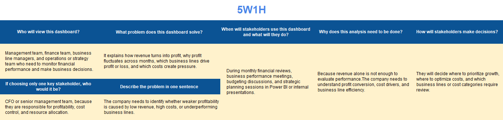
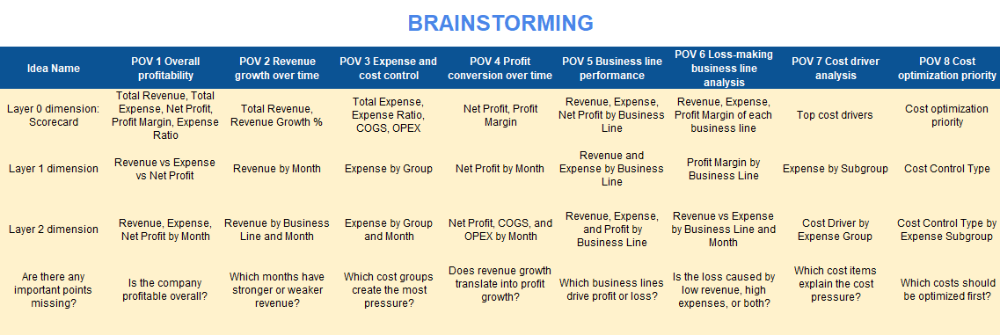
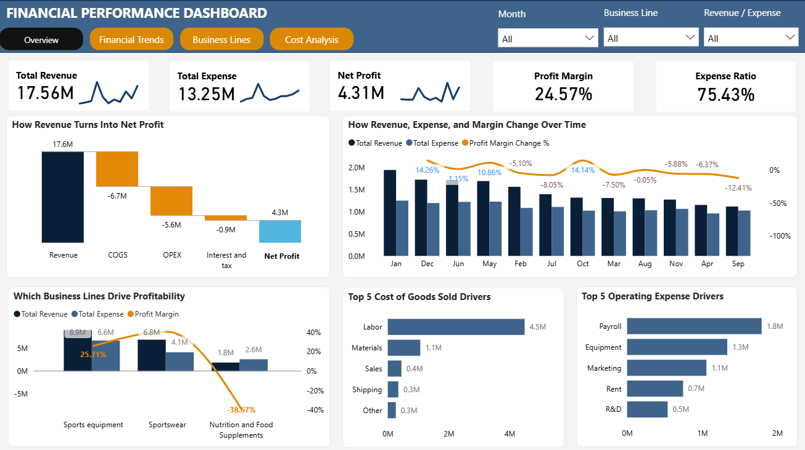

# Financial Performance Dashboard 2023

## 1. Project Context

This project analyzes the 2023 financial performance of a sports and wellness-related retail company. The company operates across three main business lines: Sports equipment, Sportswear, and Nutrition and Food Supplements.

The purpose of this project is to go beyond financial reporting and use Power BI to understand how revenue is converted into profit, which business lines contribute most effectively, and which cost categories create the greatest pressure on profitability.

## 2. Dataset

The dataset contains monthly revenue and expense records for the company in 2023. Each row represents a financial record by month, business line, income or expense type, income/expense group, and expense subgroup.

The dataset is used to calculate financial metrics such as total revenue, total expense, net profit, profit margin, expense ratio, COGS, OPEX, and EBIT.

### Data Dictionary

| Column | Description |
|---|---|
| Year | Year of revenue or expense |
| Month - name | Month of revenue or expense |
| Month - sequence | Month of revenue or expense, expressed as a number |
| Date | Date of revenue or expense, expressed as the last day of the month |
| Business Line | Business line generating revenue or expense, including Sports equipment, Sportswear, and Nutrition and Food Supplements |
| Amount, $ | Revenue or expense amount in USD |
| Expense subgroup | Additional subgroup categorizing expenses associated with OPEX and COGS |
| Income / Expense Group | Subcategory of revenue or expense. Revenue subcategories include Sales, Consulting and Professional Services, and Other Income. Expense subcategories include OPEX, COGS, and Interest and Tax |
| Income or expense | Column indicating whether the associated amount is revenue or expense |

## 3. Business Problem

The company generated revenue throughout 2023, but management needs to understand whether that revenue was effectively converted into profit. Looking only at total revenue is not enough, because profitability can be weakened by high expenses, inefficient business lines, or cost categories that put pressure on margins.

The key business problem is to identify where profit is being created or reduced: across time, across business lines, and across major cost categories. This helps stakeholders decide which areas should be prioritized for growth, optimized for cost efficiency, or reviewed before further investment.

The dashboard is designed to answer the following business questions:

1. Is the company financially healthy overall?
2. How did revenue, expenses, and profit change over time?
3. Which business lines should be prioritized, maintained, optimized, or reviewed?
4. Which cost categories create the most pressure on profitability?
5. Where should cost optimization efforts be focused?

## 4. Report Audience

This dashboard is designed for management teams, finance teams, business line managers, and operations or strategy teams.

- Management teams can use the dashboard to evaluate overall financial health and make resource allocation decisions.
- Finance teams can use it to monitor revenue, expenses, COGS, OPEX, EBIT, profit margin, and expense ratio.
- Business line managers can use it to compare revenue, cost, profitability, and margin across business lines.
- Operations and strategy teams can use it to identify cost drivers and cost optimization opportunities.

## 5. Tools Used

- Power BI
- Power Query
- DAX
- Data Modeling
- Financial Analysis
- Data Storytelling

## 6. Design Thinking Process

Before building the Power BI dashboard, the Design Thinking framework was used to clarify the business context, stakeholder needs, key metrics, and dashboard structure.

The process includes three stages: Empathize, Define Point of View, and Ideate.

### Stage 1: Empathize

This stage focuses on understanding the stakeholder, business problem, dashboard users, and key decision-making needs.

#### 5W1H

#### Empathy Map

---

### Stage 2: Define Point of View

This stage defines the main business value, Northstar Metrics, and important analytical viewpoints. The selected Northstar Metrics are Net Profit and Profit Margin because the dashboard focuses on both revenue growth and cost control.

#### Northstar Metric

#### Define Point of View

---

### Stage 3: Ideate

This stage explores possible dashboard ideas and organizes them into a clear dashboard structure. The final dashboard follows a top-down flow: overall financial health, financial trends, business line performance, and cost analysis.

#### Brainstorming

#### Structure Idea

## 7. Dashboard Pages

### Page 1: Overview

This page provides a high-level summary of the company’s financial performance in 2023. It gives a quick view of revenue, expenses, net profit, profit margin, and expense ratio, while also showing how revenue is converted into net profit after major cost layers.

**Key insight:**  
The company was profitable in 2023 with 17.56M in revenue, 4.31M in net profit, and a profit margin of 24.57%. However, total expenses reached 13.25M, resulting in a high expense ratio of 75.43%. The profit bridge shows that COGS and OPEX were the main cost layers reducing profitability, rather than interest and tax.

When narrowing down by business line, Sports equipment generated the highest revenue but also carried high expenses, while Sportswear converted revenue into profit most effectively with the strongest margin. In contrast, Nutrition and Food Supplements was the key concern because its expenses exceeded its revenue, resulting in a negative margin. The cost driver charts further show that Labor, Payroll, Equipment, and Marketing were the major cost pressure points.

---

### Page 2: Financial Performance Analysis

This page analyzes how revenue, expenses, net profit, COGS, and OPEX changed over time. It helps evaluate whether revenue growth was translated into profit improvement.

**Key insight:**  
The company maintained positive revenue throughout the year, but profit performance was not stable. Revenue was strongest in January and December, while net profit dropped noticeably in months such as April, September, and November. This shows that the company did not have a revenue problem across the whole year, but it had a profit conversion problem in several months.

The second chart shows that COGS and OPEX played an important role in shaping monthly net profit. In months where net profit weakened, COGS and OPEX remained relatively high compared with revenue. This suggests that weaker profit was not caused only by lower revenue, but also by cost pressure.

The growth chart supports this finding. Revenue growth and net profit growth did not always move in the same direction. Some months had revenue recovery, but profit did not improve at the same pace. This means revenue growth alone was not enough to improve financial performance if costs were not controlled.

When narrowing down by business line, Sports equipment contributed the largest share of revenue across the year, while Sportswear remained a meaningful contributor. Nutrition and Food Supplements contributed the smallest revenue share, suggesting that this business line had limited ability to support overall profitability.

The P&L breakdown confirms the main issue: the company generated 17.56M in revenue and 10.85M in gross profit, but COGS of 6.71M and OPEX of 5.60M significantly reduced operating profit. Therefore, the root cause of weaker profit months appears to be cost pressure, especially from COGS and OPEX, rather than a complete lack of revenue.

---

### Page 3: Business Line Performance

This page compares Sports equipment, Sportswear, and Nutrition and Food Supplements in terms of revenue, expenses, net profit, and profit margin. It identifies which business lines drive revenue scale, which ones generate stronger profitability, and which ones require review.

**Key insight:**  
The profit bridge shows that the company generated 17.56M in revenue and kept 4.31M as net profit after COGS, OPEX, interest, and tax. This confirms that the company was profitable overall, but the next question is which business lines actually contributed to or weakened this profit.

The business line comparison shows that Sports equipment generated the highest revenue at 8.9M, but also had high expenses of 6.6M, leaving 2.3M in net profit. Sportswear generated lower revenue at 6.8M, but with lower expenses of 4.1M, it delivered the highest net profit at 2.7M. In contrast, Nutrition and Food Supplements generated only 1.8M in revenue but incurred 2.6M in expenses, resulting in a loss of -0.7M.

The margin chart confirms this difference in profitability. Sportswear had the strongest profit margin at 40.2%, while Sports equipment had a lower but still positive margin of 25.71%. Nutrition and Food Supplements had a negative margin of -38.67%, showing that this business line did not convert revenue into profit.

The monthly revenue trend also shows that Nutrition and Food Supplements remained the smallest revenue contributor throughout the year. Therefore, its loss appears to come from both weak revenue scale and expenses that were too high compared with the revenue generated.

Based on the decision matrix, Sportswear should be prioritized because it has the strongest profitability, Sports equipment should be maintained and optimized because it drives the largest revenue, and Nutrition and Food Supplements should be reviewed before further investment.

---

### Page 4: Cost and Category Analysis

This page analyzes the company’s expense structure and identifies major cost drivers. It also classifies cost categories based on whether they can be optimized, reviewed carefully, or are difficult to reduce.

**Key insight:**  
The cost structure shows that COGS and OPEX are the two main expense groups. COGS accounts for 6.71M, or 50.67% of total expenses, while OPEX accounts for 5.60M, or 42.31%. Interest and tax only accounts for 0.93M, meaning the main cost pressure comes from core business operations rather than financing or tax-related items.

Across the year, COGS stayed higher than OPEX in most months, which confirms that production-related costs were the largest layer affecting profitability. The top cost drivers also show that Labor is the biggest cost item at 4.5M, followed by Payroll at 1.8M and Equipment at 1.3M. This suggests that people and operating capacity are the main sources of cost pressure.

The cost ratio trend shows that both COGS ratio and OPEX ratio increased from Q1 to Q3 before decreasing in Q4. This means cost pressure peaked around Q3 and improved toward the end of the year. However, because the overall expense ratio remained high at 75.43%, cost control is still an important priority.

The optimization detail shows that variable costs such as Marketing, Materials, Packaging, and Shipping can be optimized first because they are more flexible. In contrast, Labor, Payroll, and Equipment should be reviewed carefully because they are semi-fixed or fixed costs and may directly support business operations.

Therefore, the key finding from this page is that the company should not cut costs blindly. The better approach is to optimize flexible costs first, then review major people and capacity-related costs based on productivity, utilization, and contribution to revenue.

## 8. Conclusion and Strategic Recommendations

### 8.1 Conclusion

The company remained profitable in 2023, generating 17.56M in revenue and 4.31M in net profit. However, the expense ratio was high at 75.43%, which means a large share of revenue was consumed by costs.

The main issue is not simply revenue generation, because the company maintained positive revenue throughout the year. The deeper issue is profit conversion. Revenue did not always translate into stronger profit due to high cost pressure from COGS and OPEX.

At the business line level, Sportswear showed the strongest profitability, while Sports equipment generated the largest revenue but carried higher expenses. Nutrition and Food Supplements was the only loss-making business line, with expenses higher than revenue.

At the cost level, COGS and OPEX were the main cost layers affecting profitability. Labor, Payroll, and Equipment were the largest cost drivers, suggesting that the company should review cost efficiency carefully before making reduction decisions.

### 8.2 Recommendations

Based on the analysis, the company should focus on improving profit conversion rather than only increasing revenue.

- Prioritize Sportswear because it has the strongest profit margin and converts revenue into profit most effectively.
- Maintain and optimize Sports equipment because it is the largest revenue driver, but its high expense level reduces profitability.
- Review Nutrition and Food Supplements before further investment because this business line generated negative profit.
- Optimize variable costs first, especially Marketing, Materials, Packaging, and Shipping, because these costs are more flexible.
- Review Labor, Payroll, and Equipment carefully before cutting costs, because these costs may directly support operations and revenue generation.

### 8.3 Strategic Summary

The recommended strategy is to grow profitable revenue, protect the main revenue driver, and review the loss-making business line.

| Business Line | Decision | Reason |
|---|---|---|
| Sportswear | Prioritize | Highest profit margin and strongest profit conversion |
| Sports equipment | Maintain / Optimize | Largest revenue driver but high expense level |
| Nutrition and Food Supplements | Review | Negative profit and expenses higher than revenue |

Overall, the company should not cut costs blindly. Instead, it should optimize costs selectively by focusing on flexible cost categories first, while carefully reviewing major cost drivers that support business operations.

**Strategic direction:**  
Improve profitability by prioritizing high-margin business lines, optimizing high-cost revenue drivers, and reviewing loss-making activities before further investment.
